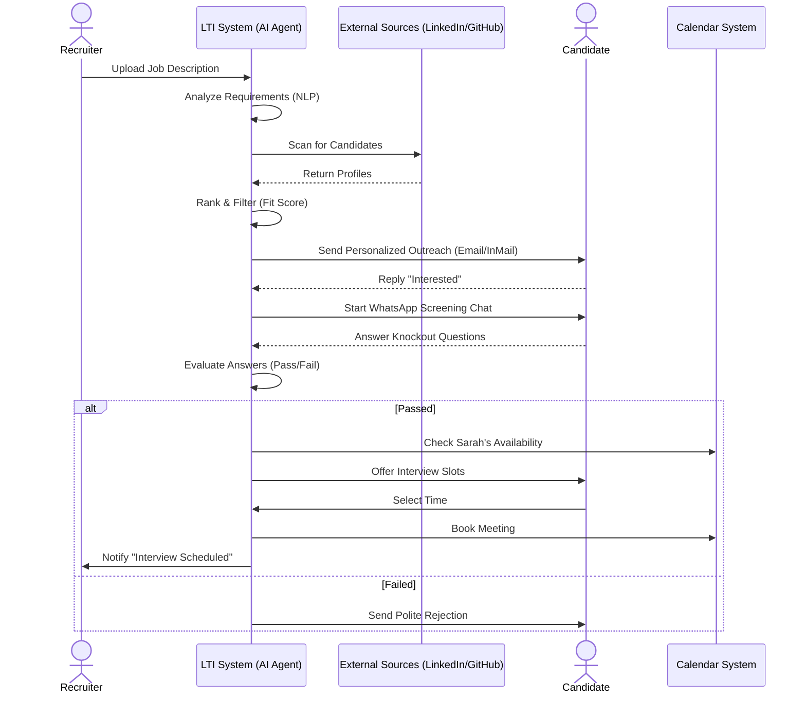
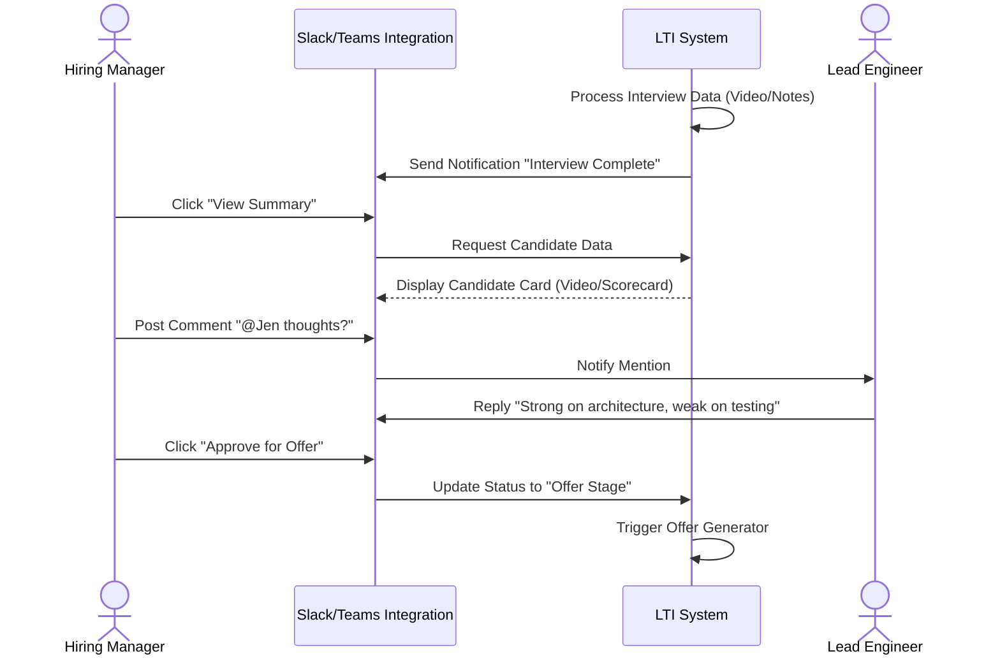
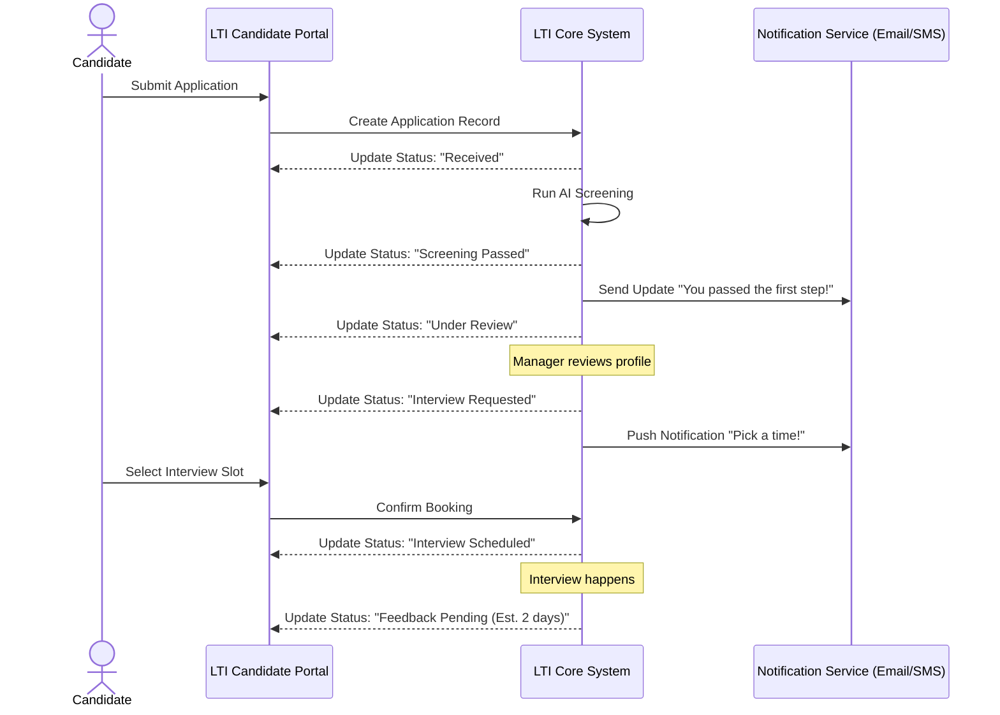
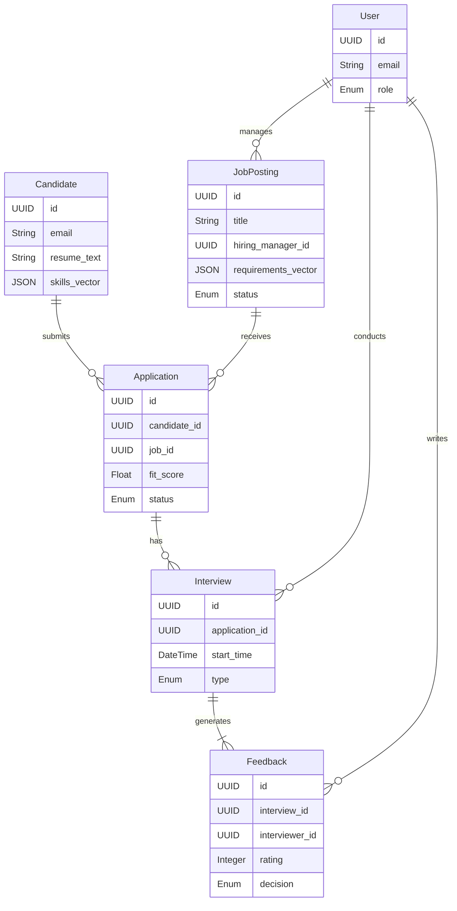
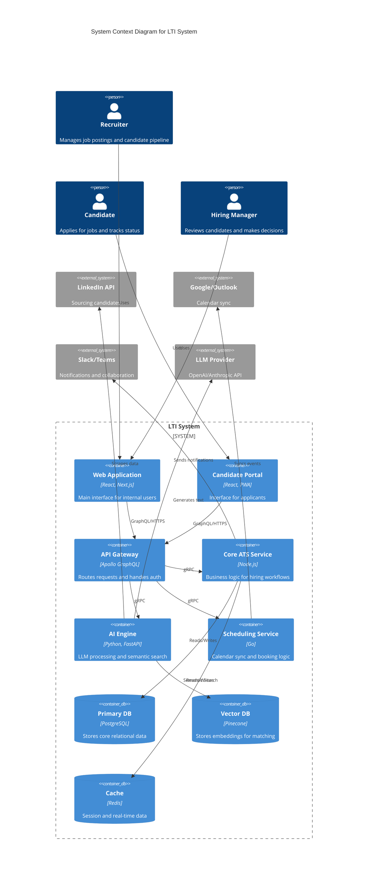
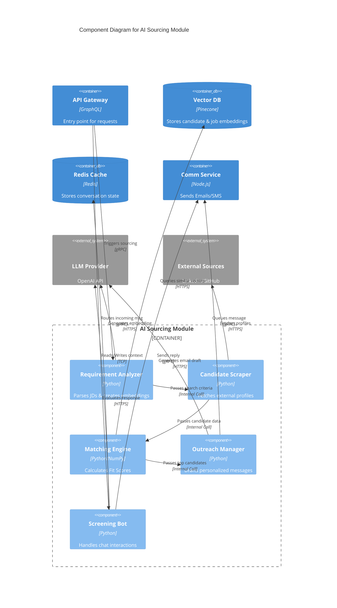

# LTI - The Future of Talent Acquisition

## 1. Brief Description of LTI Software

**LTI (Linked Talent Intelligence)** is a next-generation Applicant Tracking System (ATS) designed to transform recruitment from a transactional process into a strategic, collaborative, and human-centric experience. 

Unlike legacy systems that act as static repositories for resumes, LTI is an **AI-native ecosystem** that actively orchestrates the hiring lifecycle. It seamlessly bridges the gap between recruiters, hiring managers, and candidates through real-time collaboration, intelligent automation, and predictive insights. LTI is built to eliminate the "black hole" of recruitment, ensuring transparency, speed, and precision in every hire.

## 2. Added Value

LTI delivers value by addressing the core inefficiencies and frustrations of modern recruitment:

*   **For HR & Recruiters:**
    *   **Zero-Admin Workflow:** Drastically reduces manual tasks (scheduling, screening, email follow-ups) by up to 70% through autonomous agents that handle logistics.
    *   **Deep Talent Insights:** Moves beyond keyword matching to semantic understanding of skills and potential, surfacing hidden gems that traditional filters miss.

*   **For Hiring Managers:**
    *   **Frictionless Collaboration:** No more email threads. Managers collaborate in a shared, Slack-like workspace within the candidate profile, enabling real-time feedback, @mentions, and instant decision-making.
    *   **Predictive Quality of Hire:** AI analyzes team composition and candidate attributes to predict cultural add and performance potential before the offer is made.

*   **For Candidates:**
    *   **Transparent Journey:** A "FedEx-style" tracking portal gives candidates real-time visibility into their application status, eliminating ghosting and anxiety.
    *   **Instant Engagement:** AI-driven concierge provides 24/7 interaction, answering questions and scheduling interviews instantly via their preferred channel (WhatsApp, SMS, Email).

## 3. Competitive Advantages

LTI differentiates itself from market leaders (like Greenhouse, Lever, and Workday) through three key pillars:

### 🚀 A. "True AI" vs. "Add-on AI"
While competitors bolt on basic AI features, LTI is **AI-native**. Our core engine uses advanced Large Language Models (LLMs) trained on recruitment data to:
*   **Auto-Interview:** Conduct initial voice or chat-based screening interviews that adapt to candidate responses.
*   **Bias Neutralization:** actively rewrites job descriptions and anonymizes profiles during initial review to ensure diverse hiring.
*   **Smart Sourcing:** Proactively scans the open web to identify and engage passive candidates who match the "DNA" of your top performers.

### 🤝 B. Radical Collaboration
We treat hiring as a team sport. LTI replaces the clunky approval chains of legacy ATS with **synchronous collaboration hubs**.
*   **Live Scorecards:** Interviewers can see each other's notes in real-time (optional) or aggregate them instantly post-interview to reach consensus faster.
*   **Integrated Workspace:** Full functionality embedded within Microsoft Teams and Slack, so managers never have to log into a separate "HR tool."

### 🔮 C. Predictive Ecosystem
LTI doesn't just track what happened; it predicts what *will* happen.
*   **Attrition Risk Analysis:** Flags candidates who show signs of being "high flight risk" based on career history patterns.
*   **Time-to-Fill Forecasting:** Tells you exactly how long a role will take to fill based on current market conditions, allowing for better resource planning.

## 4. Main Functions

LTI is built around four core functional modules, each designed to maximize efficiency, collaboration, and intelligence.

### 🧠 A. AI-Driven Sourcing & Screening (The "Talent Engine")
This module automates the top of the funnel, ensuring recruiters spend time on *people*, not profiles.
*   **Semantic Match & Rank:** Instead of keyword counting, LTI uses NLP to understand the *meaning* of a resume. It ranks candidates by "Fit Score" (0-100%) based on skills, experience, and potential, highlighting *why* a candidate is a good match.
*   **Passive Candidate Crawler:** An autonomous agent that scans public data (LinkedIn, GitHub, Behance) to find passive candidates who match the job criteria and automatically drafts personalized outreach messages.
*   **Blind Screening Mode:** A toggle that anonymizes candidate profiles (hiding name, gender, university, photo) during the initial review phase to eliminate unconscious bias and focus purely on merit.
*   **Smart Chatbot Assistant:** A 24/7 candidate concierge that answers FAQs, collects missing information, and conducts initial "knockout" questions via WhatsApp or SMS.

### 🤝 B. Collaborative Hiring Workspace (The "War Room")
A centralized hub where hiring teams align, discuss, and decide in real-time.
*   **Slack/Teams Integration:** Full bi-directional sync. Managers can approve job reqs, review candidate summaries, and submit interview feedback directly from their chat app without logging into the ATS.
*   **Live Interview Cockpit:** A split-screen interface for interviewers showing the candidate's profile, a structured question bank, and a shared notepad where interviewers can see each other's notes in real-time (optional).
*   **Async Video Debriefs:** Instead of scheduling another meeting, interviewers can record short 30-second video summaries of their impressions, which are attached to the candidate's profile for the hiring manager to review.

### ⚡ C. Automated Scheduling & Logistics (The "Auto-Pilot")
Eliminates the back-and-forth of scheduling, handling complex logistics automatically.
*   **Smart Calendar Overlay:** LTI overlays the calendars of all interviewers to find optimal slots. It then sends the candidate a dynamic link to book their own time, automatically handling time zone conversions.
*   **Interview Rescheduling Bot:** If a candidate or interviewer cancels, the bot automatically reaches out to both parties to find the next best time, updating calendar invites without recruiter intervention.
*   **Offer Letter Generator:** Auto-populates offer letters with approved salary data and sends them for e-signature (DocuSign integration), tracking when the candidate views and signs.

### 📊 D. Predictive Talent Analytics (The "Oracle")
Turns data into foresight to improve hiring strategy.
*   **Quality of Hire Prediction:** Uses historical data to predict how successful a candidate will be in a specific role/team, flagging potential risks (e.g., "Candidates with this profile have a 20% higher attrition rate in this department").
*   **Diversity Pipeline Tracker:** Real-time dashboards that visualize the diversity of the candidate pool at every stage, alerting recruiters if the pipeline becomes unbalanced so they can course-correct immediately.
*   **Market Pulse:** Benchmarks salary offers against real-time market data to ensure competitiveness, flagging if an offer is too low to close the candidate.

## 5. Lean Canvas

| **Problem** | **Solution** | **Unique Value Proposition** | **Unfair Advantage** | **Customer Segments** |
| :--- | :--- | :--- | :--- | :--- |
| 1. **Inefficient Processes:** Recruiters drown in admin (scheduling, screening), leading to slow hiring.   2. **Black Hole Experience:** Candidates are ghosted and frustrated by opaque processes.   3. **Poor Collaboration:** Hiring managers and recruiters work in silos (email/spreadsheets).   4. **Bad Hires:** Decisions based on gut feel rather than data, leading to high attrition. | 1. **AI Automation:** Autonomous agents for sourcing, screening, and scheduling.   2. **Transparent Portal:** Real-time status tracking for candidates.   3. **Collaborative Hub:** Slack-like workspace for instant team alignment.   4. **Predictive Analytics:** Data-driven insights on quality of hire and team fit. | **The First "Self-Driving" Recruitment Platform.**    LTI transforms the ATS from a passive filing cabinet into an active, intelligent partner that predicts, automates, and orchestrates the entire hiring lifecycle. | 1. **Proprietary AI Models:** Trained on niche recruitment datasets for superior matching accuracy.   2. **Seamless Ecosystem:** Native integration with daily tools (Slack, Teams, Zoom) unlike legacy competitors.   3. **Predictive Engine:** Ability to forecast time-to-fill and attrition risk. | 1. **Mid-Market Tech Companies:** High growth, need speed, value candidate experience.   2. **Remote-First Organizations:** Need strong digital collaboration tools.   3. **Forward-Thinking Enterprise:** Looking to modernize legacy HR stacks (Workday/Oracle alternative). |
| | | | | |
| **Key Metrics** | | | | **Channels** |
| 1. **Time-to-Hire:** Reduction in days to fill a role.   2. **Candidate Net Promoter Score (cNPS):** Satisfaction of applicants.   3. **Recruiter Efficiency:** Hours saved on admin tasks per week.   4. **Quality of Hire:** Retention rate of new hires after 12 months. | | | | 1. **Direct Sales:** Targeted outreach to HR leaders and CTOs.   2. **Content Marketing:** Thought leadership on "The Future of Hiring" (Whitepapers, Webinars).   3. **Partnerships:** Integration partners (Slack, Microsoft, LinkedIn).   4. **Product-Led Growth:** Free trial for small teams/startups. |
| | | | | |
| **Cost Structure** | | | | **Revenue Streams** |
| 1. **R&D:** Heavy investment in AI/LLM development and infrastructure.   2. **Sales & Marketing:** Customer acquisition costs (CAC).   3. **Cloud Infrastructure:** Hosting and data processing costs.   4. **Customer Success:** Onboarding and support teams. | | | | 1. **SaaS Subscription:** Tiered pricing based on company size/seats (Starter, Growth, Enterprise).   2. **Add-on Modules:** Premium AI features (e.g., advanced sourcing bot) as upsells.   3. **API Access:** Enterprise API usage fees for custom integrations. |

## 6. Main Use Cases

Here are the three primary use cases that demonstrate the core value of LTI for its main users.

### Use Case 1: AI-Powered Sourcing & Initial Screening
**Actor:** Recruiter (Sarah)
**Goal:** Find and shortlist qualified candidates for a "Senior React Developer" role without manual searching.

**Flow:**
1.  Sarah inputs the job description into LTI.
2.  LTI's **Sourcing Agent** analyzes the requirements and scans LinkedIn, GitHub, and internal databases.
3.  The agent identifies 50 potential matches and ranks them by "Fit Score."
4.  The agent automatically sends a personalized outreach message to the top 20 candidates.
5.  A candidate (Alex) replies with interest.
6.  LTI's **Chatbot** engages Alex via WhatsApp, asks 3 knockout questions (salary, visa, experience), and parses the answers.
7.  If Alex passes, the Chatbot auto-schedules a screening call on Sarah's calendar.

### Use Case 2: Collaborative Decision Making
**Actor:** Hiring Manager (Mike)
**Goal:** Review interview feedback and make a hiring decision efficiently.

**Flow:**
1.  Mike receives a Slack notification from LTI: "Interview with Alex completed."
2.  Mike clicks "View Summary" in Slack.
3.  LTI presents a **Candidate Card** with the interview recording, a 30-second AI-generated video summary, and the interviewer's scorecard.
4.  Mike @mentions the Lead Engineer in the thread: "@Jen, what did you think of his system design skills?"
5.  Jen replies in the thread.
6.  Mike clicks "Approve for Offer" directly in Slack.
7.  LTI triggers the Offer Generation workflow.

### Use Case 3: Transparent Candidate Journey
**Actor:** Candidate (Alex)
**Goal:** Track application status and stay informed without "ghosting."

**Flow:**
1.  Alex applies for a job via the LTI portal.
2.  LTI creates a "Tracker Dashboard" for Alex (similar to a pizza delivery tracker).
3.  Alex logs in and sees his status: "Application Received" -> "AI Screening Passed" -> "Under Review by Manager."
4.  When the status changes to "Interview Requested," Alex receives a push notification.
5.  Alex opens the portal to select a time slot.
6.  After the interview, Alex sees a "Feedback Pending" status with an estimated decision date (predicted by LTI).

## 7. Data Model

The LTI data model is designed to support high-volume recruitment, rich AI metadata, and complex relationship mapping between candidates, jobs, and hiring teams.

### Key Entities & Attributes

#### 1. **Candidate**
Represents the talent profile.
*   `id` (UUID): Unique identifier.
*   `first_name` (String): Candidate's first name.
*   `last_name` (String): Candidate's last name.
*   `email` (String): Primary contact email (Unique).
*   `phone` (String): Contact number.
*   `linkedin_url` (String): Link to public profile.
*   `resume_text` (Text): Full parsed text of the resume for NLP.
*   `skills_vector` (Vector/JSON): AI-generated embedding of skills for semantic search.
*   `created_at` (DateTime): Timestamp of profile creation.

#### 2. **JobPosting**
Represents a specific role opening.
*   `id` (UUID): Unique identifier.
*   `title` (String): Job title (e.g., "Senior React Developer").
*   `department` (String): Department (e.g., "Engineering").
*   `hiring_manager_id` (UUID): FK to User (The owner of the role).
*   `status` (Enum): DRAFT, OPEN, CLOSED, ON_HOLD.
*   `description` (Text): Full job description.
*   `requirements_vector` (Vector/JSON): AI-generated embedding of job requirements.
*   `salary_range_min` (Decimal): Minimum salary.
*   `salary_range_max` (Decimal): Maximum salary.

#### 3. **Application**
The link between a Candidate and a JobPosting.
*   `id` (UUID): Unique identifier.
*   `candidate_id` (UUID): FK to Candidate.
*   `job_id` (UUID): FK to JobPosting.
*   `status` (Enum): APPLIED, SCREENING, INTERVIEW, OFFER, HIRED, REJECTED.
*   `fit_score` (Float): AI-calculated match score (0.0 - 1.0).
*   `ai_summary` (Text): Brief AI-generated summary of why the candidate fits.
*   `current_stage` (String): Current step in the pipeline.
*   `applied_at` (DateTime): Timestamp of application.

#### 4. **Interview**
A scheduled event between a Candidate and Interviewer(s).
*   `id` (UUID): Unique identifier.
*   `application_id` (UUID): FK to Application.
*   `start_time` (DateTime): Scheduled start time.
*   `end_time` (DateTime): Scheduled end time.
*   `type` (Enum): SCREENING, TECHNICAL, BEHAVIORAL, FINAL.
*   `video_link` (String): URL for the meeting (Zoom/Teams).
*   `status` (Enum): SCHEDULED, COMPLETED, CANCELLED.
*   `recording_url` (String): Link to the stored recording.

#### 5. **Feedback**
The scorecard or review left by an interviewer.
*   `id` (UUID): Unique identifier.
*   `interview_id` (UUID): FK to Interview.
*   `interviewer_id` (UUID): FK to User.
*   `rating` (Integer): Overall score (1-5).
*   `pros` (Text): Positive feedback.
*   `cons` (Text): Areas for improvement.
*   `decision` (Enum): STRONG_HIRE, HIRE, NO_HIRE, STRONG_NO_HIRE.
*   `submitted_at` (DateTime): Timestamp.

#### 6. **User**
System users (Recruiters, Hiring Managers, Interviewers).
*   `id` (UUID): Unique identifier.
*   `email` (String): Corporate email.
*   `role` (Enum): ADMIN, RECRUITER, HIRING_MANAGER, INTERVIEWER.
*   `department` (String): User's department.

### Entity Relationship Diagram (ERD)

## 8. High-Level System Design

The LTI architecture follows a **modern, event-driven microservices pattern** to ensure scalability, real-time performance, and seamless AI integration.

### Core Components

1.  **Frontend Clients (SPA & Mobile):**
    *   **Web App (React/Next.js):** The primary interface for recruiters and hiring managers.
    *   **Candidate Portal (Mobile-First):** A lightweight PWA for candidates to track status and schedule interviews.
    *   **Mobile App (React Native):** For hiring managers to review and approve on the go.

2.  **API Gateway (GraphQL Federation):**
    *   Acts as the single entry point, routing requests to appropriate services.
    *   Handles authentication, rate limiting, and request aggregation.

3.  **Core Backend Services (Node.js/Go):**
    *   **Auth Service:** Manages users, roles, and SSO (Okta/Google).
    *   **ATS Core Service:** Handles standard CRUD for Jobs, Candidates, and Applications.
    *   **Scheduling Service:** Integrates with Google/Outlook Calendars to manage bookings.
    *   **Communication Service:** Manages emails, SMS (Twilio), and WhatsApp (Business API).

4.  **AI Engine (Python/FastAPI):**
    *   **LLM Wrapper:** Interfaces with OpenAI/Anthropic for text generation (emails, summaries).
    *   **Vector Database (Pinecone/Milvus):** Stores embeddings for semantic search (matching candidates to jobs).
    *   **Agent Orchestrator (LangChain):** Manages autonomous agents for sourcing and screening.

5.  **Real-Time Layer:**
    *   **WebSocket Server (Socket.io):** Pushes live updates (notifications, typing indicators) to the frontend.
    *   **Event Bus (Kafka/RabbitMQ):** Decouples services, allowing async processing (e.g., "Application Received" event triggers "AI Screening" and "Email Notification").

6.  **Data Storage:**
    *   **PostgreSQL:** Primary relational DB for structured data (Users, Jobs).
    *   **Redis:** Caching layer for high-speed access and session management.
    *   **S3/Blob Storage:** Stores resumes, profile photos, and interview recordings.

### Architecture Diagram (C4 Container)

## 9. C4 Component Diagram: AI Sourcing Module

This diagram zooms into the **AI Engine Container**, specifically focusing on the **AI Sourcing Module** responsible for Use Case 1 (Sourcing & Screening).

### Component Breakdown

1.  **Requirement Analyzer:**
    *   Receives the Job Description from the API Gateway.
    *   Uses the LLM to extract key skills, experience levels, and "nice-to-haves."
    *   Converts these requirements into a vector embedding.

2.  **Candidate Scraper:**
    *   Triggered by the Requirement Analyzer.
    *   Connects to external sources (LinkedIn, GitHub) to fetch public profiles matching the criteria.
    *   Respects rate limits and `robots.txt`.

3.  **Matching Engine:**
    *   The core brain. It compares the Job Requirement Vector against Candidate Vectors stored in the Vector DB.
    *   Calculates a cosine similarity score ("Fit Score").
    *   Filters out candidates below a certain threshold (e.g., < 70%).

4.  **Outreach Manager:**
    *   Takes the top-ranked candidates.
    *   Prompts the LLM to generate a personalized email/message based on the candidate's specific profile and the job value proposition.
    *   Queues the message in the Communication Service.

5.  **Screening Bot:**
    *   Handles incoming replies via Webhooks.
    *   Maintains conversation state (context) in Redis.
    *   Evaluates candidate answers against "Knockout Criteria" defined in the Job Posting.

### Diagram

